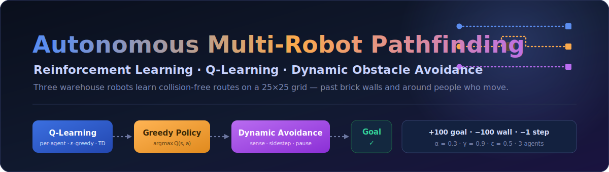
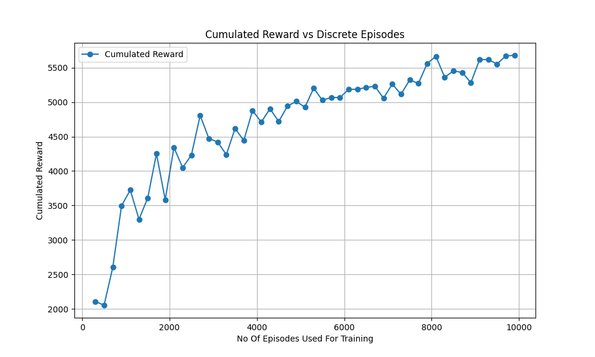
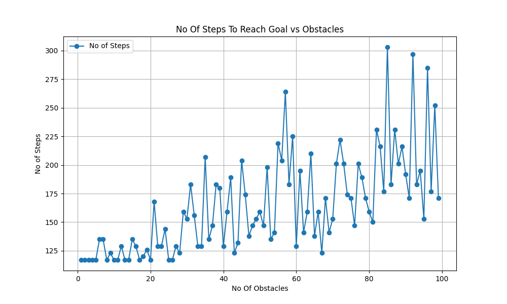
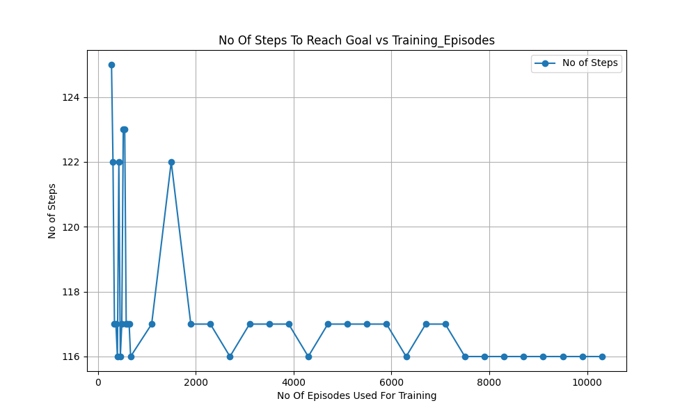

<div align="center">



<br/>

### In this project we have 3 agents. These three warehouse robots(agents), each taught from scratch by trial and error to find the shortest route to itself — then through the stochastic environment they reach their assigned goal. Randomness is what makes traditional DL non-useful here and RL comes here to save us.

When we don't have any supervised data, we can use RL to learn from creating the data itself through exploration and exploitation. Each robot runs on its own **Q-Learning** table called 'experience', learns the grid by bumping into walls and getting rewarded for reaching its goal and avoids the unpredictable humans at run time with a lightweight sense-and-sidestep policy. In the environment agents learn where the obstacles are where the goals are using reward & penality through TD-Learning.

<br/>

[](Project_Video_Final.mp4)
&nbsp;

<br/>


</div>

---

## The problem I was solving

Walk into an Amazon or Flipkart fulfilment centre and you'll see dozens of order-picking robots crossing the same floor at once — each headed somewhere different, none of them allowed to crash into a shelf, a person or each other. That's the problem I wanted to model: **many agents, many goals, one shared and partly unpredictable space.**

The honest difficulty isn't the static layout — walls don't move and a robot can simply *learn* them. The difficulty is the people. A human can appear in any free cell and wander off in any direction and there's no dataset that covers "what the floor looks like next." So I split the problem cleanly in two:

- **What's fixed, the robot learns.** Whenever in-simulation robots collide with the walls they get penalized & that's how they learn.
- **What's random, don't learn them because they are just noise signal.** The moving humans are handled *at run time* with a sense-and-sidestep rule, deliberately kept *out* of the learning so they don't poison it.

```
   random Q-table          after Q-Learning            at run time
   wanders, hits      ->    knows the shortest    ->    follows it, but steps
   walls, no clue           route to its goal           aside for moving people
```

---

## What you're looking at

A `25 × 25(Can change)` grid warehouse, rendered in pygame and driven by three independent robots:

- **3 robots**, starting from three corners(can start from any positions), each with its own colour (blue, orange, purple assigned) and its own assigned goal shelf.
- **Static obstacles** — the brick walls. Fixed and learned during exploration.
- **70 moving humans(can change)** — spawned on random free cells, taking a random walk every tick. They dodge walls and goals but will happily walk into a robot; it's the robot's job never to let that happen.
- **Drawn paths** — each robot trails a coloured line so that we can inspect and see how they are approaching.

The full run is captured in [`Project_Video_Final.mp4`](Project_Video_Final.mp4) in this repo.

---

## How a robot learns its route

Reinforcement learning is the right tool exactly *because* there's no data to imitate — the robot is dropped into the grid and learns from the consequences of its own moves. Each robot keeps a **Q-table**: for every cell, a value for each of the four moves (up, down, left, right), We derive policy from the table. It starts as all zeros and gets sharpened, one episode at a time.

```mermaid
flowchart LR
    Z[Q-table = 0<br/>every cell, 4 actions] --> EP

    subgraph EP [One episode: start -> goal]
      direction TB
      PICK{&#949;-greedy choice} -->|explore, prob &#949;| RND[random move]
      PICK -->|exploit, prob 1-&#949;| BEST[argmax Q s,a]
      RND --> STEP[take_action -> next cell + reward]
      BEST --> STEP
      STEP --> UPD[TD update<br/>Q += &#945; r + &#947; max Q' - Q]
      UPD --> PICK
    end

    EP -->|x 10,000 episodes| POL[Greedy policy<br/>argmax Q per cell]

    classDef q fill:#3B6FE0,stroke:#1633,color:#fff;
    classDef p fill:#8B2FD6,stroke:#306,color:#fff;
    class Z,EP q;
    class POL p;
```



The learning signal is the **temporal-difference update** — every move nudges the table toward the reward seen plus the best the robot believes it can do from the next cell:

$$Q(s, a) \leftarrow Q(s, a) + \alpha\,\Big[\, r + \gamma\,\max_{a'} Q(s', a') - Q(s, a)\,\Big]$$

Moves are chosen **ε-greedy** — most of the time take the best known action, but with probability `ε` try something random, so the robot keeps discovering routes instead of locking onto the first one it finds. An episode runs from start to goal; the table is updated the whole way; after 10,000 episodes per robot, the Q-table collapses into a simple **greedy policy** — in each cell, just take the highest-valued move. The three robots are trained **sequentially**, each with its own table.

### The reward design

Everything the robot "wants" is encoded here — and the humble `−1` per step is the most important line in the table. Without a small cost on every move, nothing pushes the robot toward the *shortest* route; with it, dawdling literally costs reward, so the policy tightens up.

| Event | Reward | Why |
|---|:---:|---|
| Reach the assigned goal | **+100** | the whole point |
| Hit a brick wall | **−100** | hard "never do this" |
| Step onto another robot's goal / home | **−50** | treat rivals' cells as walls — keeps lanes separate |
| Step off the grid | **−10** | stay inside the warehouse |
| Any ordinary step | **−1** | the pressure that produces *shortest* paths |

---

## Why the humans are left out of training — and how they're handled anyway

This was the central design call, so it's worth being explicit about.

The humans are **randomly placed and randomly moving**. If I folded them into Q-Learning, the table would be chasing a target that reshuffles every run — the same cell would look safe in one episode and fatal in the next, and the Q-values would never settle. Training on pure noise doesn't teach caution; it just destabilises everything the robot *could* have learned about the walls and the goal. So the humans never enter the learning loop at all.

Instead they're dealt with **live, at execution**, on top of the already-learned policy:

```mermaid
stateDiagram-v2
    [*] --> Humans
    Humans --> Intend: humans take a random step
    Intend --> Check: each robot proposes its greedy move
    Check --> Move: cell is clear
    Check --> Decide: collision predicted
    Decide --> Pause: with prob 0.2 &#8212; wait, let them pass
    Decide --> Sidestep: else step to a safe neighbour cell
    Sidestep --> Move: safe cell found
    Sidestep --> Pause: no safe cell &#8212; hold position
    Move --> Done: all robots on their goals?
    Pause --> Done
    Done --> Humans: not yet
    Done --> [*]: yes
```



The robot is assumed to **sense** where the humans are (a stand-in for on-board sensors — in the sim I just read their true positions). Before committing a move it checks the cell it's about to enter. If a human or another robot is heading there, it makes a choice borrowed straight from the explore/exploit idea: with probability `0.2` it **pauses** and lets the traffic clear, otherwise it **sidesteps** to any safe neighbouring cell and re-plans from there. If nothing's safe, it simply holds. The result: humans bump into robots in the logs, but robots never bump into humans.

---

## The knobs

| Parameter | Value | Meaning |
|---|:---:|---|
| Grid | `25 × 25` | the warehouse floor |
| Robots | `3` | independent agents, one Q-table each |
| Actions | `4` | up · down · left · right |
| Learning rate `α` | `0.3` | how much a new observation overwrites the old value |
| Discount `γ` | `0.9` | how much the next cell's best value matters now |
| Exploration `ε` | `0.5` | chance of a random move while learning |
| Episodes | `10,000` | training runs per robot |
| Moving humans | `70` | random-walk dynamic obstacles |
| Pause probability | `0.2` | how often a blocked robot waits vs. sidesteps |

---

## Does it actually learn? The experiments

I ran three sweeps with [`Performance_test.py`](Performance_test.py) — using a single robot, since the trends are identical across all three — to check that the system behaves the way a real learner should.

### 1 · More training → more reward, then diminishing returns

<div align="center"></div>

Cumulated reward climbs steeply out of the gate — roughly `2,000` at a few hundred episodes — and keeps rising until it flattens around `5,600` past `~8,000` episodes. That plateau is the policy converging: there's only so much reward to extract from an optimal route, and the robot finds it.

### 2 · More moving humans → more detours

<div align="center"></div>

With pausing switched off (`pause = 0`) so every avoidance is a *sidestep*, the steps-to-goal climb from `~117` with a near-empty floor to `170–300` as the human count approaches `100`. Noisy — because the crowd is random — but unmistakably upward: a busier warehouse costs more moves.

### 3 · More training → shorter paths

<div align="center"></div>

Hold the crowd fixed and grow the training instead, and the steps needed to reach the goal settle from `122–125` down to a stable `~116` by `~8,000` episodes. The policy isn't just *reaching* the goal — it's reaching it *efficiently*.

None of these three are surprising for a working RL system — and that's exactly the point. They're the sanity checks that say the learning is real, not luck.

---

## Two ways to run it

Install the handful of dependencies first:

```bash
pip install pygame numpy matplotlib
```

**Train and watch the simulation** — the straightforward version:

```bash
python main__.py
```

It trains the three robots (with an on-screen progress bar), then drops them into the warehouse to route around the moving crowd to their goals.

**The interactive control room** — [`Executable_File.py`](Executable_File.py):

```bash
python Executable_File.py
```

This one wraps the same engine in a live control panel — sliders for **episodes, ε, pause probability, human count, and FPS**, buttons to **Start/Train & Run, Reset, and Export CSV**, keyboard shortcuts (`S` / `R` / `E`), and a **scenario** toggle that cycles three warehouse presets: *Warehouse Picking*, *Sortation Hub*, and *Last-Mile Dock*. Change a knob, rerun, and watch the behaviour shift in real time.

**Reproduce the plots** — [`Performance_test.py`](Performance_test.py) runs the parameter sweeps above and writes the PNGs.

---

## Where things live

```
.
├── main__.py            train 3 Q-Learning agents + run the pygame simulation
├── Executable_File.py   interactive build: control panel, sliders, scenarios, CSV export
├── Performance_test.py  parameter sweeps that generate the result plots
├── Project_Video_Final.mp4              recorded demo run
├── Performance-1_cumulated_reward_vs_episodes.png
├── Performance-2_No_of_steps_vs_Obstacles_Number.png
├── Performance-3_No_of_steps_vs_Training_episodes.png
├── robot.png · home.png · bricks.png · human.png   grid sprites
└── assets/banner.svg
```

---

## Limitations & where I'd take it next

I'd rather name the rough edges than hide them:

- **Sequential training.** The three robots learn one after another, not in parallel — simple, but slow to scale past a handful of agents.
- **No coordination.** Each robot optimises for itself with zero awareness of the others' *plans* (it only reacts to their current positions). The natural next step is **cooperative multi-agent RL**, where the robots share intent and negotiate the floor instead of just dodging on contact.
- **Tabular Q-Learning** caps out as the grid grows; a `DQN` would let the same idea scale to much larger, richer warehouses.

---

## Real-world shape of the problem

The same loop — learn the fixed layout, react to the moving people — is what sits under warehouse pickers (Amazon-style), airport and hospital delivery bots, and hotel service robots. This project is a clean, watchable model of that core idea.

---

<div align="center">

**If this was a fun read or a useful reference, a star goes a long way.**

</div>
